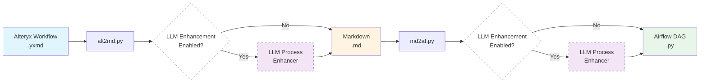
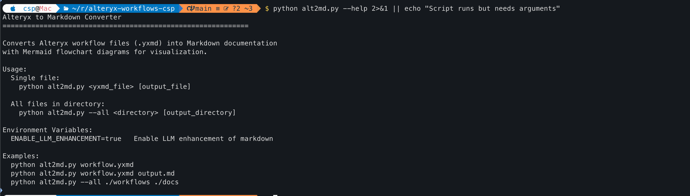

# Alteryx Workflow Repository

Welcome to the Alteryx Workflow Repository! This repository hosts a collection of Alteryx workflows designed to streamline data processing, analysis, and automation tasks.

## Overview

In this repository, you will find:

- **Alteryx Workflows**: .yxmd or .yxzp files containing data workflows for data preparation, blending, analysis, and reporting.
- **Data Files**: Sample data files or connections used within the workflows.
- **Documentation**: Guides, tutorials, and explanations on how to use, customize, and deploy the workflows.
- **Scripts**: Any additional scripts or tools used alongside Alteryx workflows.

## Architecture



**Legend:**
- Solid boxes: Required steps
- Dashed boxes: Optional LLM enhancement (configurable via `.env`)

## Workflow Conversion Tools

This repository includes a 2-step conversion pipeline with optional LLM enhancement:

### Step 1: Alteryx to Markdown (`alt2md.py`)

Converts Alteryx `.yxmd` files to Markdown documentation with Mermaid flowchart diagrams.

**Usage:**
```bash
# Convert a single workflow to markdown
python alt2md.py sample.yxmd sample.md

# Convert all workflows in a directory
python alt2md.py --all "." "docs"

# Show help
python alt2md.py --help
```

**Output:** Generates comprehensive documentation including:
- Workflow overview and metadata
- Mermaid flowchart diagram
- Detailed tool configurations
- Data flow analysis

### Step 2: Markdown to Airflow DAG (`md2af.py`)

Converts Markdown documentation (with Mermaid diagrams) to Apache Airflow DAG Python files.

**Usage:**
```bash
# Convert a single markdown file
python md2af.py sample.md sample_dag.py

# Convert all markdown files in a directory
python md2af.py --all "docs" "output/dags"

# Show help
python md2af.py --help
```

### Complete Conversion Pipeline

Use these tools in sequence for a complete workflow:

```bash
# Step 1: Convert Alteryx to Markdown
python alt2md.py sample.yxmd sample.md

# Step 2: Convert Markdown to Airflow DAG
python md2af.py sample.md sample_dag.py
```

### LLM Enhancement (Optional)

Enable AI-powered enhancement of your conversions by setting the environment variable:

```bash
# In your .env file
ENABLE_LLM_ENHANCEMENT=true
```

When enabled, the LLM will:
- **In Step 1 (alt2md.py)**: Enhance markdown documentation with better descriptions, context, and insights
- **In Step 2 (md2af.py)**: Improve Airflow DAG code with better error handling, logging, and best practices

**Supported LLM Providers:**
- Ollama (local)
- OpenAI (API key required)
- Google Gemini (API key required)
- llama.cpp (local server)

Configure your provider in `.env`:
```bash
LLM_PROVIDER=llama.cpp
LLAMA_CPP_URL=http://127.0.0.1:8080/v1
```

See `.env.sample` for all configuration options.

### Legacy Tool: Direct Conversion (`alterxy2airflow.py`)

Directly converts Alteryx `.yxmd` files to Apache Airflow DAG Python files (without markdown intermediate step).

**Usage:**
```bash
# Convert a single workflow
python alterxy2airflow.py "Accident Workflow.yxmd" "accident_dag.py"

# Convert all workflows in a directory
python alterxy2airflow.py --all "." "output/dags"
```

### Supported Alteryx Tools

The converters support the following Alteryx tool types:
- File Input/Output (CSV, Excel)
- Formula
- Filter
- Sort
- Sample
- Summarize/Aggregate
- Browse
- Multi-Row Formula
- Table Composer
- Charts
- Macro Input/Output
- Join, Union, Select
- Data Cleansing
- Running Total
- Transpose, Cross Tab

## Usage

To utilize the Alteryx workflows in this repository:

1. **Clone or Download**: Clone this repository to your local machine or download it as a ZIP file.
2. **Install Alteryx Designer**: If you haven't already, download and install [Alteryx Designer](https://www.alteryx.com/designer-trial).
3. **Open Workflow**: Open the desired Alteryx workflow (.yxmd or .yxzp file) using Alteryx Designer.
4. **Configure Input and Output**: If necessary, configure input connections to your data sources and output destinations.
5. **Run the Workflow**: Execute the workflow to perform data processing, blending, or analysis tasks.
6. **Review Results**: Review the output data and any generated reports or visualizations to gain insights.

## Formatting

To maintain consistency and readability across Alteryx workflows, please adhere to the following formatting guidelines:

- Organize the workflow with clear and logical workflows.
- Use meaningful names for tools, inputs, outputs, and macros.
- Include annotations and comments to explain complex workflows or logic.
- Follow best practices for efficient data processing and optimization.

## Git Commands for Alteryx Workflows

When collaborating on Alteryx workflows within this repository, consider using Git commands to manage changes efficiently:

- `git clone <repository_url>`: Clone the repository to your local machine.
- `git add <file>`: Add the modified Alteryx workflow file (.yxmd or .yxzp) to the staging area.
- `git commit -m "Your commit message"`: Commit the changes along with a descriptive message indicating the purpose of the modifications.
- `git push origin <branch>`: Push the committed changes to the remote repository, making them available to other team members.
- `git pull origin <branch>`: Pull the latest changes from the remote repository to your local machine.


## Feedback

Your feedback is valuable to us! If you have any questions, suggestions, or encounter any issues while using our Alteryx workflows, please don't hesitate to
[open an issue](https://github.com/nandita2000/Alteryx-workflows/issues) in this repository.

## License

This repository is licensed under the [MIT License](LICENSE). Feel free to use, modify, and distribute the workflows and resources as needed, but please attribute the original work appropriately.

## Contact

For any inquiries or further assistance, please contact [nanditasharma182@gmail.com].

Thank you for using our Alteryx workflows! We hope they streamline your data processing and analysis tasks effectively. Happy workflow building!


## Screenshots
