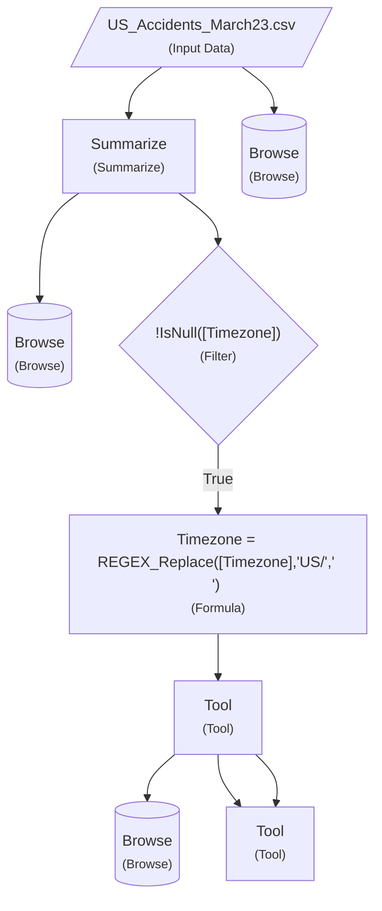

Here is the enhanced Markdown documentation:

---
# Sample Workflow
Generated: 2026-03-11 00:38:55  
Source: `sample.yxmd`

---

## Overview

This workflow consists of 9 tools and 9 connections, processing a dataset from `US_Accidents_March23.csv`. The workflow includes a variety of tool types, including input/output tools, filter/decision tools, processing tools, and browse/display tools.

### Key Statistics

- **Total Tools:** 9
- **Total Connections:** 9
- **Tool Types:** 6 (Input/Output: 2, Filter/Decision: 3, Processing: 4)

## Workflow Diagram

> **Note:** The diagram illustrates the workflow structure, with different shapes representing various tool types:
> - Parallelograms: Input/Output tools (`1`, `3`, `4`)
> - Diamonds: Filter/Decision tools (`5`, `16` and its successor)
> - Rectangles: Processing tools (`2`, `17`, `22`)
> - Stadiums: Browse/Display tools (`7`, `22`)

## Tool Details

### Tool 1: Input Data (US_Accidents_March23.csv)

**Description:** The input dataset, containing accident data for March 23.

**Configuration: