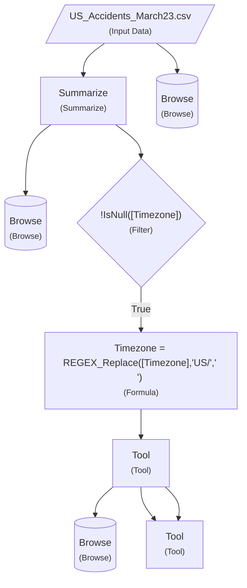

# sample

**Generated:** 2026-03-11 00:44:56  
**Source:** `sample.yxmd`

---

## Overview

This workflow contains 9 tools and 9 connections.

### Statistics

- **Total Tools:** 9
- **Total Connections:** 9
- **Tool Types:** 6

## Workflow Diagram

> **Note:** The diagram shows the workflow structure with different shapes representing different tool types:
> - Parallelograms: Input/Output tools
> - Diamonds: Filter/Decision tools
> - Rectangles: Processing tools
> - Stadiums: Browse/Display tools

## Tool Details

### Tool 4: Browse

### Tool 3: Browse

### Tool 7: Browse

### Tool 16: Formula

**Description:** Timezone = REGEX_Replace([Timezone],"US/"," ")

**Formulas:**

### Tool 1: Input Data

**Description:** US_Accidents_March23.csv

**Configuration:**

- **File:** `C:\Users\ash_s\Downloads\archive (8)\US_Accidents_March23.csv`
- **Header Row:** True
- **Delimiter:** `,`

### Tool 2: Summarize

**Aggregations:**

### Tool 5: Filter

**Description:** !IsNull([Timezone])

**Filter Condition:**

- **Field:** `Timezone`
- **Operator:** IsNotNull
- **Value:** `Serious`

### Tool 17: Tool

### Tool 22: Tool

## Data Flow

### Input Sources

- **Tool 1** (Input Data)

### Output Destinations

- **Tool 3** (Browse)
- **Tool 4** (Browse)
- **Tool 7** (Browse)
- **Tool 22** (Tool)

---

*This documentation was automatically generated from the Alteryx workflow file.*
